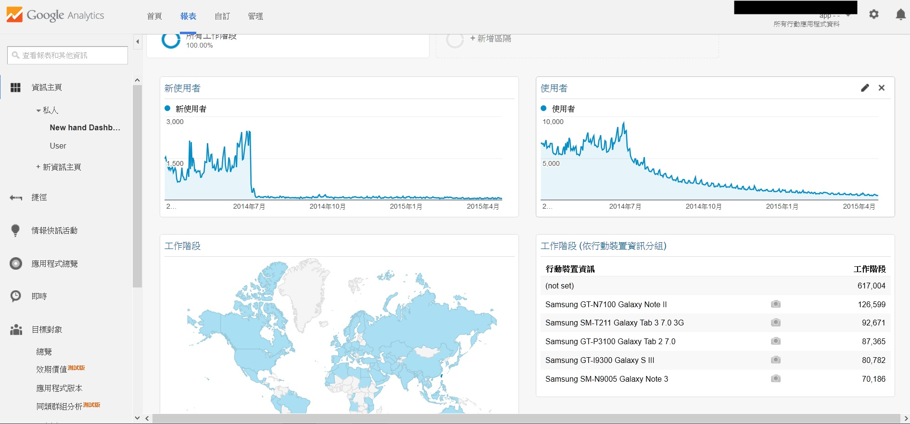

**這個分享是使用RGoogleAnalytics 套件獲取GA上的資料。
這樣使用者就可以進一步使用R做 GA 分析**

## Google Analytics

[Google Analytics (GA)](http://www.google.com/analytics/)可以幫助您統計分析您的網站和移動裝置的免費服務。 

**GA 網站畫面**

**GA 網站畫面**

## 先前步驟 

  - 當然, 你需要先有 GA 帳號 , 然後也已經擁有 GA 數據 , 才有意義
  
  
  
  
  
  - 而後, 你需要到 [Google Developers Console](https://console.developers.google.com) 申請使用 Google Api 的授權
  
  - 獲得 Google Api 授權後， 記下 Client id 跟 Client Secret
    
    
## RGoogleAnalytics Outline
  - Install Library

  - Authentication - Oath2
  
  - Get Profile
  
  - Get Data

### 安裝

install.packages("RGoogleAnalytics")

### 授權

//Using RGoogleAnalytics library

library(RGoogleAnalytics)

//Copy client id and client secret from Google Developers Consol

client.id <- "XXXXXXXX"

client.secret <- "YYYYYYYY"

//Getting Oath using Oath2

oath_token <- Auth(client.id=client.id, client.secret =  client.secret)

//Save the token if you want

save(oath_token, file="oath_token")

### 獲取報表  

Google Analytics 可以設置不同的報表組, 例如: Web 報表， Mobile 報表等。 以 Mobile 為例 不同的 APP 也很有可能有著不同的報表。使用 GetProfiles function 可以列出所有的報表。

// Load if nessesary

load("oath_token")

// Check if token validate

ValidateToken(oath_token)

// Getting Profiles

profile <- GetProfiles(oath_token)

profile

### 獲取資料

// if not specify table id in gaExamples.R

ga.table.id <- "ga:79915131" 

// See the chart of Type of visitor

// Init 將 Query 參數做成 list

query.list <- Init(start.date = "2014-01-01",
                   end.date = "2014-03-15",
                   dimensions = "ga:userType",
                   metrics = "ga:users",
                   max.result = 500,
                   sort = "ga:users",
                   filters = NULL,
                   table.id = ga.table.id)
                   
//build the query object 並且做 Validation

ga.query <- QueryBuilder(query.list)

// Get the ReportData

ga.data <- GetReportData(ga.query, oath_token)

ga.data

userrow <- rownames(ga.data)

pie(ga.data$users, labels = ga.data$userType, col = rainbow(14))

## 其他相關網站
### 相關的 Google Analytics 連結
  - [Query Explore](https://ga-dev-tools.appspot.com/explorer/) 提供網頁介面使用 Core Reporting API  (核心報表 API)
    
  - [Dimensions & Metrics Explorer](https://ga-dev-tools.appspot.com/dimensions-metrics-explorer/) Matrics 和 Dimensions 的文件

### RGoogleAnalystics 連結

  - [Github](https://github.com/Tatvic/RGoogleAnalytics/)
    
  - [Issues](https://github.com/Tatvic/RGoogleAnalytics/issues)
